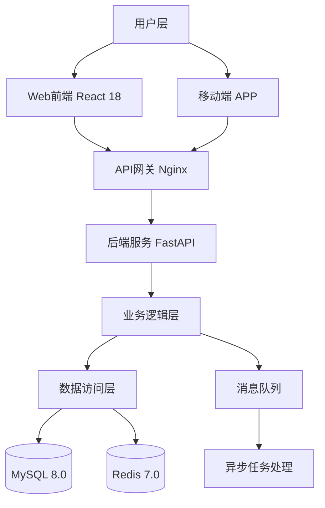

# 软件著作权申请材料完整示例

> 本示例基于一个虚构的「XX智能考勤管理软件 V1.0」，展示完整的申请材料填写方式。

---

## 示例一：申请表信息

### 一、软件基本信息

| 填写项 | 内容 |
|--------|------|
| **软件全称** | XX智能考勤管理软件 |
| **版本号** | V1.0 |
| **软件简称** | XX考勤软件 |
| **软件分类** | 应用软件 |

### 二、权利信息

| 填写项 | 内容 |
|--------|------|
| **权利取得方式** | 原始取得 |
| **权利范围** | 全部权利 |
| **软件说明** | 原创 |
| **开发方式** | 单独开发 |

### 三、时间信息

| 填写项 | 内容 |
|--------|------|
| **开发完成日期** | 2025年12月31日 |
| **发表状态** | 已发表 |
| **发表日期** | 2026年1月15日 |

### 四、开发环境

| 填写项 | 内容 |
|--------|------|
| **开发硬件环境** | x86-64 PC，处理器Intel Core i7，内存16GB，硬盘512GB SSD |
| **开发操作系统** | Windows 11 专业版 |
| **开发工具** | Visual Studio Code 1.85、Git 2.43、Docker Desktop 4.26 |

### 五、运行环境

| 填写项 | 内容 |
|--------|------|
| **运行硬件环境** | x86-64服务器，处理器主频2.0GHz以上，内存8GB以上，硬盘100GB以上 |
| **运行平台** | Windows 10及以上 / Ubuntu 20.04及以上 / Web浏览器（Chrome 90+、Firefox 88+） |
| **支撑软件** | MySQL 8.0、Redis 7.0、Nginx 1.24、Node.js 18.0 |

### 六、技术信息

| 填写项 | 内容 |
|--------|------|
| **编程语言** | TypeScript 5.0（前端）、Python 3.11（后端） |
| **源程序量** | 15,680 行（不含空行和注释） |
| **面向领域/行业** | 企业人力资源管理 |

### 七、功能描述

**主要功能**：

本软件是一款面向企业人力资源管理的智能考勤管理软件，主要用于企业员工考勤数据的采集、统计、分析和报表生成。软件提供以下核心功能：（1）多终端打卡功能：支持手机APP、Web端、人脸识别设备等多种打卡方式，实时采集员工考勤数据；（2）智能排班管理：支持灵活排班配置，自动计算加班、调休、请假等考勤异常情况；（3）考勤数据统计与分析：提供多维度考勤数据统计报表，支持按部门、人员、时间段等维度进行数据分析；（4）假期管理：支持年假、病假、事假等多种假期类型管理，自动计算假期余额；（5）系统集成：提供标准API接口，支持与HR系统、薪资系统等企业系统集成。本软件适用于各类企业的人力资源部门，能够有效提升考勤管理效率，减少人工统计错误，降低管理成本。

**技术特点**：

本软件采用前后端分离架构，前端基于React 18框架构建，后端采用Python FastAPI框架，具有高性能、易扩展的特点。在数据处理方面，采用Redis缓存热点数据，有效降低数据库压力；在安全方面，采用JWT令牌认证机制，所有敏感数据采用AES-256加密存储；在性能方面，支持10,000+并发用户访问，考勤数据查询响应时间不超过200ms。

### 八、AI辅助开发声明

| 填写项 | 内容 |
|--------|------|
| **是否使用AI工具** | 是 |
| **AI工具名称** | GitHub Copilot |
| **AI工具用途** | 代码补全、单元测试用例生成 |
| **人工创作比例** | 85% |

### 九、著作权人信息

| 填写项 | 内容 |
|--------|------|
| **著作权人名称** | XX科技有限公司 |
| **著作权人类型** | 法人 |
| **联系地址** | XX省XX市XX区XX路XX号XX大厦XX层 |
| **邮政编码** | 100000 |
| **联系人** | 张三 |
| **联系电话** | 138XXXXXXXX |
| **电子邮件** | zhangsan@xxtech.com |

---

## 示例二：软件操作说明书（节选）

### 第1章 软件概述

#### 1.1 软件基本信息

| 项目 | 内容 |
|------|------|
| 软件全称 | XX智能考勤管理软件 |
| 版本号 | V1.0 |
| 开发完成日期 | 2025年12月31日 |
| 发表日期 | 2026年1月15日 |
| 著作权人 | XX科技有限公司 |
| 开发方式 | 单独开发 |

#### 1.2 开发语言与技术栈

**编程语言**：TypeScript 5.0（前端）、Python 3.11（后端）

**主要框架**：React 18（前端）、FastAPI 0.104（后端）

**数据库**：MySQL 8.0（主数据库）、Redis 7.0（缓存）

**其他技术**：Docker 24.0（容器化部署）、Nginx 1.24（反向代理）

#### 1.4 主要功能概述

本软件是一款面向企业人力资源管理的智能考勤管理软件，主要解决企业考勤数据采集不准确、统计效率低、报表生成繁琐等问题。

软件提供以下核心功能：

1. **多终端打卡**：支持手机APP、Web端、人脸识别设备等多种打卡方式，实时采集员工考勤数据，确保数据准确性。
2. **智能排班管理**：支持灵活排班配置，自动计算加班、调休、请假等考勤异常情况，减少人工干预。
3. **考勤统计分析**：提供多维度考勤数据统计报表，支持按部门、人员、时间段等维度进行数据分析，辅助管理决策。
4. **假期管理**：支持年假、病假、事假等多种假期类型管理，自动计算假期余额，员工可在线申请假期。
5. **系统集成**：提供标准RESTful API接口，支持与HR系统、薪资系统等企业系统集成，实现数据互通。

### 第2章 功能模块与流程图（节选）

#### 2.1 系统整体架构

**架构说明**：

本系统采用前后端分离的三层架构设计。用户层包括Web前端和移动端APP两种访问方式，均通过Nginx API网关统一接入后端服务。后端采用FastAPI框架构建RESTful API服务，业务逻辑层负责考勤规则计算、数据统计分析等核心业务处理，数据访问层通过ORM框架与MySQL数据库和Redis缓存交互。对于耗时的报表生成、数据导出等操作，通过消息队列异步处理，避免阻塞主服务。

#### 2.4.1 多终端打卡模块

**功能说明**：

多终端打卡模块是本软件的核心数据采集模块，负责接收来自不同终端的打卡请求，进行数据验证和存储。该模块支持三种打卡方式：Web端打卡（基于IP地址和地理位置验证）、移动端APP打卡（基于GPS定位和人脸识别验证）、硬件设备打卡（通过设备API接口接收打卡数据）。模块内置防重复打卡机制，同一员工在设定时间窗口内的重复打卡请求将被自动过滤。所有打卡记录实时写入数据库，并通过Redis缓存提供快速查询。

**输入**：员工ID、打卡时间、打卡方式、位置信息（GPS坐标）、设备标识

**输出**：打卡结果（成功/失败）、打卡记录ID、当日考勤状态

**处理逻辑**：
1. 接收打卡请求，验证员工身份（JWT令牌验证）
2. 检查打卡时间是否在有效排班时间范围内
3. 验证打卡位置是否在允许范围内（地理围栏检查）
4. 检查是否存在重复打卡（查询Redis缓存）
5. 写入打卡记录到数据库
6. 更新Redis缓存中的当日考勤状态
7. 返回打卡结果

---

## 示例三：AI辅助开发声明（完整版）

### A.1 AI辅助开发声明

本软件在开发过程中使用了以下AI工具辅助开发：

| AI工具名称 | 用途 | 使用阶段 |
|-----------|------|---------|
| GitHub Copilot | 代码补全（主要用于重复性代码的快速生成，如CRUD接口、数据库模型定义） | 编码阶段 |
| GitHub Copilot | 单元测试用例生成（辅助生成测试框架代码，测试逻辑由人工编写） | 测试阶段 |

人工创作比例：约85%

说明：AI工具（GitHub Copilot）主要用于辅助生成重复性的样板代码（如数据库模型定义、API路由注册、基础CRUD操作等），占总代码量的约15%。软件的核心业务逻辑（考勤规则引擎、排班算法、数据统计分析模块）、系统架构设计、数据库设计、安全机制设计均完全由人工完成。所有AI生成的代码均经过人工审查、修改和测试，确保代码质量和业务正确性。

### A.2 开源组件声明

本软件使用了以下开源组件：

| 组件名称 | 版本 | 许可证 | 使用方式 |
|---------|------|--------|---------|
| React | 18.2.0 | MIT | 调用（前端UI框架） |
| FastAPI | 0.104.1 | MIT | 调用（后端API框架） |
| SQLAlchemy | 2.0.23 | MIT | 调用（ORM框架） |
| Redis-py | 5.0.1 | MIT | 调用（Redis客户端） |
| PyJWT | 2.8.0 | MIT | 调用（JWT认证） |

本软件在上述开源组件的基础上进行了业务功能开发，具体创新点包括：（1）基于FastAPI框架开发了完整的考勤业务API体系，包含考勤规则引擎、排班算法等核心业务逻辑；（2）基于React框架开发了考勤管理专用的UI组件库，包含考勤日历、排班甘特图等特色组件；（3）基于SQLAlchemy开发了考勤数据模型和复杂查询逻辑，实现了多维度考勤统计分析功能。
