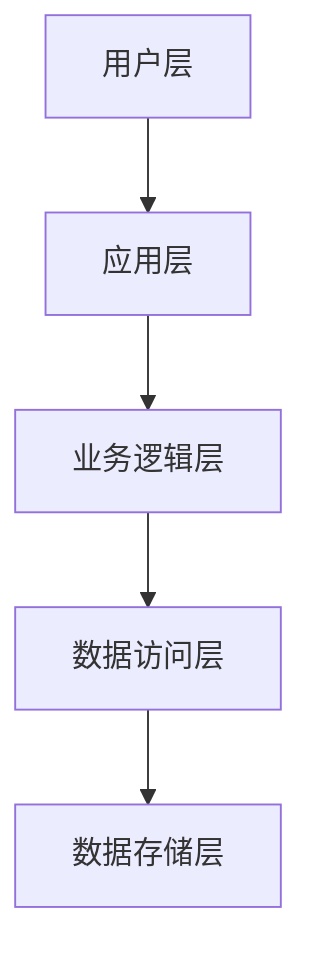
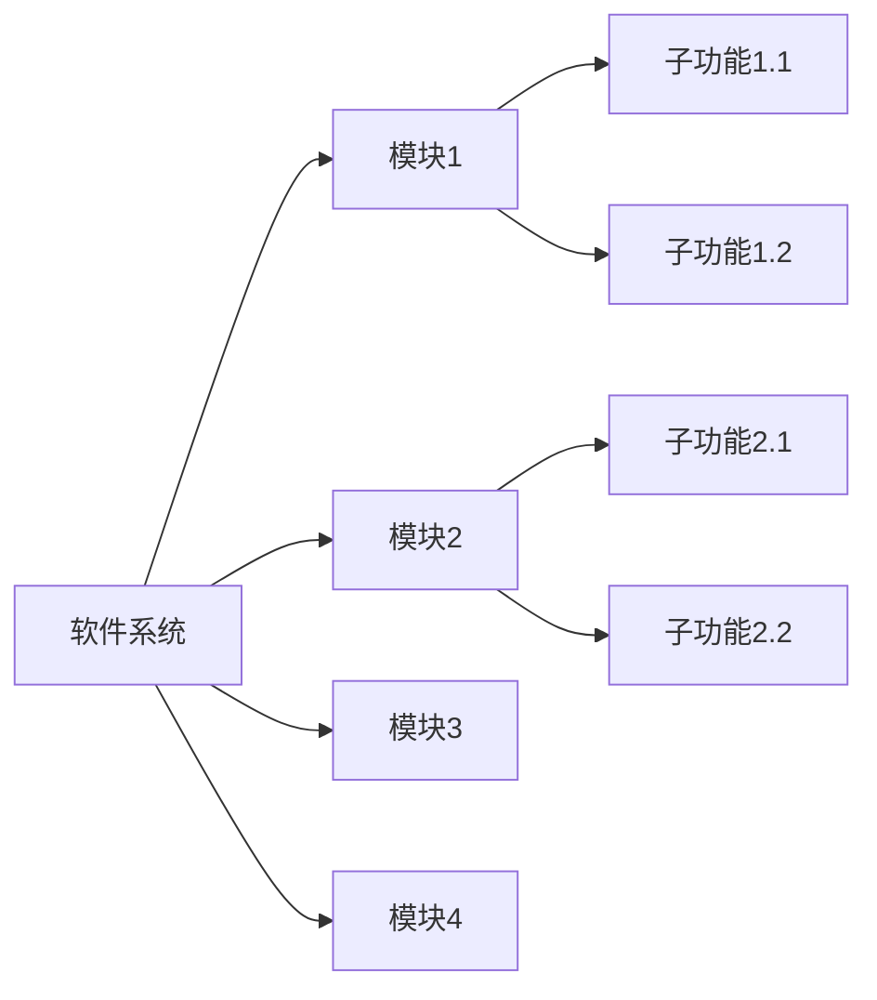
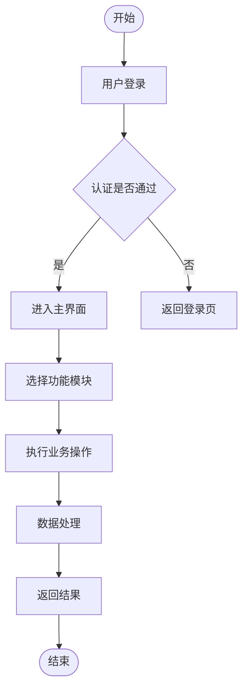
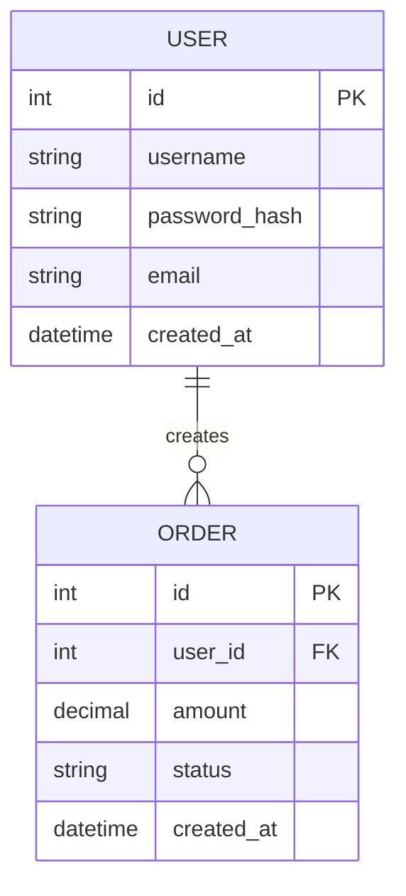

# [软件全称] [版本号]
# 软件操作说明书

---

**软件全称**：[软件全称，如：XX智能客服管理软件]
**版本号**：V1.0
**著作权人**：[著作权人名称]
**日期**：[YYYY年MM月DD日]

---

## 目录

1. 软件概述
   - 1.1 软件基本信息
   - 1.2 开发语言与技术栈
   - 1.3 运行环境
   - 1.4 主要功能概述
   - 1.5 技术特点
   - 1.6 用途与适用范围
2. 功能模块与流程图
   - 2.1 系统整体架构
   - 2.2 功能模块划分
   - 2.3 核心功能流程图
   - 2.4 各模块详细说明
3. 操作步骤与使用说明
   - 3.1 安装与部署
   - 3.2 核心功能操作
   - 3.3 常见问题与解答
4. 设计说明
   - 4.1 系统架构设计
   - 4.2 数据库设计
   - 4.3 核心算法与数据处理逻辑
   - 4.4 接口设计
   - 4.5 安全机制
   - 4.6 性能优化
   - 4.7 异常处理机制
5. 测试与维护
   - 5.1 测试环境
   - 5.2 主要测试用例与结果
   - 5.3 维护说明
   - 5.4 常见问题排查
- 附录A：声明
- 附录B：PDF格式化规范

---

## 第1章 软件概述

### 1.1 软件基本信息

| 项目 | 内容 |
|------|------|
| 软件全称 | [软件全称] |
| 版本号 | V1.0 |
| 开发完成日期 | [YYYY年MM月DD日] |
| 发表日期 | [YYYY年MM月DD日 / 未发表] |
| 著作权人 | [著作权人名称] |
| 开发方式 | [单独开发 / 合作开发 / 委托开发] |

### 1.2 开发语言与技术栈

**编程语言**：[如：Python 3.11、TypeScript 5.0、Java 17]

**主要框架**：[如：Django 4.2、React 18、Spring Boot 3.1]

**数据库**：[如：MySQL 8.0、PostgreSQL 15、MongoDB 6.0]

**其他技术**：[如：Redis 7.0、Elasticsearch 8.0、Docker 24.0]

### 1.3 运行环境

**硬件环境**：
- 处理器：[如：x86-64，主频2.0GHz以上]
- 内存：[如：8GB以上]
- 硬盘：[如：100GB以上可用空间]

**软件环境**：
- 操作系统：[如：Windows 10及以上 / Ubuntu 20.04及以上 / macOS 12及以上]
- 运行时：[如：Python 3.11 / JDK 17 / Node.js 18]
- 数据库：[如：MySQL 8.0]
- 支撑软件：[如：Nginx 1.24、Redis 7.0]

**网络环境**：[如：需要互联网连接 / 支持局域网部署 / 离线运行]

### 1.4 主要功能概述

[在此详细描述软件的主要功能，不少于200字。需说明软件能做什么、解决什么问题、有哪些核心功能模块。]

本软件主要提供以下核心功能：

1. **[功能模块1名称]**：[功能描述，50字以上]
2. **[功能模块2名称]**：[功能描述，50字以上]
3. **[功能模块3名称]**：[功能描述，50字以上]
4. **[功能模块4名称]**：[功能描述，50字以上]

### 1.5 技术特点

[描述软件的技术亮点和创新之处，不少于100字。]

本软件在技术实现上具有以下特点：

1. **[技术特点1]**：[详细说明]
2. **[技术特点2]**：[详细说明]
3. **[技术特点3]**：[详细说明]

### 1.6 用途与适用范围

**用途**：[描述软件的主要用途和应用场景]

**适用范围**：[描述软件适用的行业、用户群体、使用场景]

**面向领域**：[如：金融科技 / 医疗健康 / 教育培训 / 电子商务]

---

## 第2章 功能模块与流程图

### 2.1 系统整体架构

[在此插入系统架构图（Mermaid 图表）]



**架构说明**：

[对架构图进行文字说明，描述各层的职责和相互关系，不少于150字。]

### 2.2 功能模块划分

[在此插入功能模块划分图]



**模块关系说明**：[描述各模块之间的关系和数据流向]

### 2.3 核心功能流程图

[在此插入核心业务流程图，标注模块、数据流向、关键逻辑]



**流程说明**：[对流程图进行文字说明，描述关键节点和决策逻辑，不少于150字。]

### 2.4 各模块详细说明

#### 2.4.1 [模块1名称]

**功能说明**：[详细描述该模块的功能，不少于150字]

**输入**：[描述该模块的输入数据/参数]

**输出**：[描述该模块的输出数据/结果]

**处理逻辑**：[描述该模块的核心处理逻辑]

#### 2.4.2 [模块2名称]

**功能说明**：[详细描述该模块的功能，不少于150字]

**输入**：[描述该模块的输入数据/参数]

**输出**：[描述该模块的输出数据/结果]

**处理逻辑**：[描述该模块的核心处理逻辑]

#### 2.4.3 [模块3名称]

**功能说明**：[详细描述该模块的功能，不少于150字]

**输入**：[描述该模块的输入数据/参数]

**输出**：[描述该模块的输出数据/结果]

**处理逻辑**：[描述该模块的核心处理逻辑]

---

## 第3章 操作步骤与使用说明

### 3.1 安装与部署

#### 3.1.1 环境准备

在安装本软件前，请确保系统满足以下要求：

1. 操作系统：[具体要求]
2. 运行时环境：[如：安装 Python 3.11 / JDK 17]
3. 数据库：[如：安装并启动 MySQL 8.0]
4. 其他依赖：[如：安装 Redis 7.0]

#### 3.1.2 安装步骤

**步骤1**：[下载/获取软件安装包]

[操作说明]

[截图占位：安装包下载界面]

**步骤2**：[安装依赖]

```bash
# 示例命令
pip install -r requirements.txt
```

[操作说明]

**步骤3**：[配置数据库]

[操作说明]

[截图占位：数据库配置界面]

**步骤4**：[配置系统参数]

[操作说明，说明主要配置项的含义和设置方法]

**步骤5**：[启动软件]

```bash
# 示例启动命令
python main.py
```

[操作说明]

[截图占位：软件启动成功界面]

#### 3.1.3 验证安装

[描述如何验证软件安装成功，如访问某个URL、看到某个界面等]

### 3.2 核心功能操作

#### 3.2.1 登录与认证

**操作步骤**：

1. 打开软件，进入登录界面
2. 输入用户名和密码
3. 点击「登录」按钮
4. 系统验证通过后，进入主界面

[截图占位：登录界面]

**说明**：[描述登录相关的注意事项，如密码规则、账号锁定机制等]

#### 3.2.2 [核心功能1操作]

**功能说明**：[简要说明该功能的用途]

**操作步骤**：

1. [步骤1]
2. [步骤2]
3. [步骤3]
4. [步骤4]

[截图占位：功能操作界面]

**注意事项**：[描述使用该功能时的注意事项]

#### 3.2.3 [核心功能2操作]

**功能说明**：[简要说明该功能的用途]

**操作步骤**：

1. [步骤1]
2. [步骤2]
3. [步骤3]

[截图占位：功能操作界面]

#### 3.2.4 数据查询与导出

**操作步骤**：

1. 进入数据查询模块
2. 设置查询条件（时间范围、关键词等）
3. 点击「查询」按钮
4. 查看查询结果
5. 如需导出，点击「导出」按钮，选择导出格式（Excel/CSV/PDF）

[截图占位：数据查询界面]

#### 3.2.5 系统设置

**操作步骤**：

1. 进入系统设置模块
2. 根据需要修改相关配置
3. 点击「保存」按钮

[截图占位：系统设置界面]

### 3.3 常见问题与解答

**Q1：[常见问题1]**

A：[解答]

**Q2：[常见问题2]**

A：[解答]

**Q3：[常见问题3]**

A：[解答]

---

## 第4章 设计说明

### 4.1 系统架构设计

[详细描述系统的整体架构设计，包括分层架构、模块划分、技术选型理由等，不少于200字。]

本系统采用[架构模式，如：MVC/微服务/前后端分离]架构，主要分为以下几层：

**[层1名称]**：[职责描述]

**[层2名称]**：[职责描述]

**[层3名称]**：[职责描述]

**技术选型说明**：[说明主要技术选型的理由]

### 4.2 数据库设计

#### 4.2.1 数据库 ER 图

[在此插入数据库 ER 图]



#### 4.2.2 主要数据表说明

**表名：[表1名称]**

| 字段名 | 类型 | 说明 | 约束 |
|--------|------|------|------|
| id | INT | 主键 | PRIMARY KEY, AUTO_INCREMENT |
| [字段2] | [类型] | [说明] | [约束] |
| [字段3] | [类型] | [说明] | [约束] |
| created_at | DATETIME | 创建时间 | NOT NULL |

**表名：[表2名称]**

| 字段名 | 类型 | 说明 | 约束 |
|--------|------|------|------|
| id | INT | 主键 | PRIMARY KEY, AUTO_INCREMENT |
| [字段2] | [类型] | [说明] | [约束] |
| created_at | DATETIME | 创建时间 | NOT NULL |

### 4.3 核心算法与数据处理逻辑

[描述软件中的核心算法和数据处理逻辑，不少于200字。]

**[核心算法/逻辑1名称]**：

[详细描述算法原理、实现思路、时间复杂度等]

**[核心算法/逻辑2名称]**：

[详细描述算法原理、实现思路]

### 4.4 接口设计

[描述主要接口设计，包括内部模块接口和外部API接口]

**主要API接口**：

| 接口路径 | 方法 | 功能说明 | 请求参数 | 返回值 |
|---------|------|---------|---------|--------|
| /api/[路径1] | GET/POST | [功能] | [参数] | [返回] |
| /api/[路径2] | GET/POST | [功能] | [参数] | [返回] |

### 4.5 安全机制

[描述软件的安全设计，不少于100字。]

本软件在安全方面采取了以下措施：

1. **身份认证**：[描述认证机制，如JWT、Session等]
2. **权限控制**：[描述权限控制机制，如RBAC等]
3. **数据加密**：[描述数据加密方式]
4. **输入验证**：[描述输入验证和防注入措施]
5. **日志审计**：[描述日志记录和审计机制]

### 4.6 性能优化

[描述软件的性能优化措施，不少于100字。]

1. **缓存策略**：[描述缓存使用方式]
2. **数据库优化**：[描述索引设计、查询优化等]
3. **并发处理**：[描述并发控制机制]
4. **[其他优化措施]**：[描述]

### 4.7 异常处理机制

[描述软件的异常处理设计，不少于100字。]

1. **全局异常捕获**：[描述全局异常处理机制]
2. **业务异常处理**：[描述业务层异常处理]
3. **数据库异常处理**：[描述数据库操作异常处理]
4. **日志记录**：[描述异常日志记录方式]
5. **用户提示**：[描述向用户展示错误信息的方式]

---

## 第5章 测试与维护

### 5.1 测试环境

| 项目 | 内容 |
|------|------|
| 测试操作系统 | [如：Windows 10 专业版 / Ubuntu 22.04 LTS] |
| 测试硬件 | [如：x86-64 PC，内存16GB] |
| 测试工具 | [如：pytest、JUnit、Postman] |
| 测试数据库 | [如：MySQL 8.0（测试实例）] |

### 5.2 主要测试用例与结果

| 测试用例编号 | 测试功能 | 测试步骤 | 预期结果 | 实际结果 | 测试结论 |
|------------|---------|---------|---------|---------|---------|
| TC-001 | [功能1] | [步骤] | [预期] | [实际] | 通过/失败 |
| TC-002 | [功能2] | [步骤] | [预期] | [实际] | 通过/失败 |
| TC-003 | [功能3] | [步骤] | [预期] | [实际] | 通过/失败 |
| TC-004 | 异常处理 | [步骤] | [预期] | [实际] | 通过/失败 |
| TC-005 | 性能测试 | [步骤] | [预期] | [实际] | 通过/失败 |

**测试结论**：[总结测试结果，说明软件功能是否符合设计要求]

### 5.3 维护说明

**日常维护**：
1. [维护项目1，如：定期备份数据库]
2. [维护项目2，如：清理日志文件]
3. [维护项目3，如：监控系统资源使用]

**版本更新**：[描述版本更新的流程和注意事项]

**数据备份**：[描述数据备份策略]

### 5.4 常见问题排查

**问题1：[问题描述]**

- 可能原因：[原因分析]
- 排查步骤：[排查方法]
- 解决方案：[解决方法]

**问题2：[问题描述]**

- 可能原因：[原因分析]
- 排查步骤：[排查方法]
- 解决方案：[解决方法]

---

## 附录A：声明

### A.1 AI辅助开发声明

> 根据国家版权局2026年3月15日施行的新规，如使用AI工具辅助开发，需在此声明。

[如未使用AI工具，填写：本软件完全由人工开发，未使用任何AI工具辅助。]

[如使用了AI工具，填写：]

本软件在开发过程中使用了以下AI工具辅助开发：

| AI工具名称 | 用途 | 使用阶段 |
|-----------|------|---------|
| [工具名称] | [如：代码补全、代码生成、文档编写] | [如：编码阶段、测试阶段] |

人工创作比例：约[XX]%

说明：AI工具仅用于辅助，所有核心业务逻辑、架构设计、算法实现均由人工完成，软件的独创性表达来自人工创作。

### A.2 开源组件声明

> 如软件使用了开源组件，需在此声明。

[如未使用开源组件，填写：本软件未使用任何开源组件。]

[如使用了开源组件，填写：]

本软件使用了以下开源组件：

| 组件名称 | 版本 | 许可证 | 使用方式 |
|---------|------|--------|---------|
| [组件名] | [版本] | [MIT/Apache 2.0/GPL等] | [调用/修改/封装] |

本软件在使用上述开源组件的基础上进行了[二次开发/功能封装/业务集成]，具体创新点包括：[描述创新之处]。

---

## 附录B：PDF格式化规范

> 本文档转为PDF提交时，请严格遵循以下格式要求（2026年3月15日新规）：

### 格式要求

- **字体**：宋体或黑体，12pt
- **行间距**：1.5倍行间距
- **排版方向**：纵向（Portrait）
- **页眉**：每页必须标注「软件全称 版本号」（如：XX智能客服管理软件 V1.0）
- **页码**：右上角标注「第X页/共Y页」

### 提交规范

- **提交页数**：前30页 + 后30页
- **不足60页**：提交全部页面
- **文件格式**：PDF

### 源程序鉴别材料要求（如同时提交源程序）

- **前30页必须包含**：程序入口（main()、启动类等）、核心功能模块、关键业务逻辑
- **后30页必须包含**：程序结束逻辑（退出、资源释放）、数据持久化、异常处理
- **有效代码**：每页有效代码行数不少于50行（不含空行和注释）
- **注释建议**：核心算法、关键业务、自定义函数建议加清晰注释（注释不计入有效代码行数）
- **禁止行为**：纯复制开源代码（需二次开发并声明）、注释/空行凑数

### 审查注意事项（2026年审查红线）

- **一致性**：文档、源代码、申请表的软件名称/版本/功能描述必须完全一致
- **真实性**：截图、流程、逻辑必须真实可核验，禁止虚构
- **完整性**：禁止仅放截图无文字、无流程、无功能说明
- **原创性**：文档需体现独创性表达，不能是通用模板拼接
- **相似度**：与版权库、GitHub/Gitee做AI相似度比对，相似度过高直接驳回
